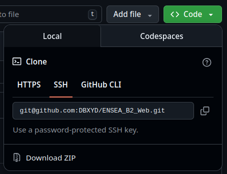
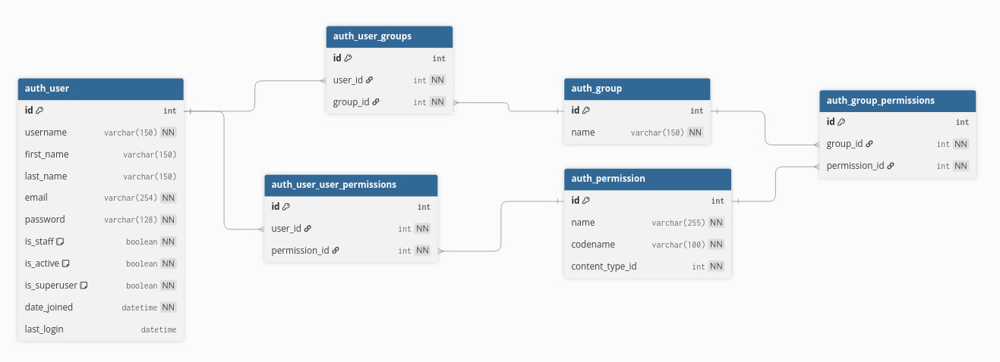

# TP Django : Gestion de la cafétéria

## Contexte

Vous allez développer une **application web pour la cafétéria de l'école**.  
Chaque étudiant a un **crédit personnel**, qu'il peut utiliser pour acheter des produits.  
L'application permettra de gérer :

- Les étudiants et leur crédit
- Les produits disponibles à la vente, leur stock et leur valeur
- Les transactions lors des achats
- Une interface moderne avec **Bootstrap**

---

## Objectifs pédagogiques

- Découvrir le framework **Django (MVT)**  
- Créer des **models** pour gérer les données  
- Utiliser des **views** et des **templates** pour afficher des pages  
- Appliquer du **CSS / Bootstrap / JS** pour l'interface  
- Concevoir la base de données avec **dbdiagram.io**  
- Comprendre **IP / LAN / localhost / accès réseau**  
- Gérer un **environnement Python isolé**  
- Versionner et sauvegarder son projet avec **Git / GitHub**  
- Répondre à des **quiz courts** pour valider la compréhension

---

## Etape 1 : Préparer le terrain : environnement Python et repository Github

### Créer un compte GitHub et un nouveau repository

Si vous n'avez pas encore de compte GitHub, commencez par en créer un :

1. Rendez-vous sur [GitHub.com](https://github.com) et cliquez sur "Sign up" (S'inscrire).
2. Remplissez le formulaire avec votre adresse email, un nom d'utilisateur unique et un mot de passe.
3. Vérifiez votre email pour activer le compte.

Une fois connecté, créez un nouveau repository :

1. Cliquez sur le bouton "+" en haut à droite et sélectionnez "New repository".
2. Donnez un nom à votre repository (ex. : "cafeteria-django").
3. Choisissez la visibilité : public (visible par tous) ou private (privé) : 
   - **Public** : Tout le monde peut voir votre code, le cloner et contribuer (si vous le permettez). Idéal pour des projets open-source ou pour partager votre travail.  
   - **Privé** : Seuls vous et les collaborateurs que vous invitez peuvent voir et accéder au repository. Utile pour des projets personnels ou confidentiels. Pour ce TP, un repository public est recommandé pour faciliter le partage.
4. Ne cochez pas "Add a README file" ni "Add .gitignore" pour l'instant, car nous les créerons localement.  
   - **README.md** : Un fichier qui décrit votre projet (objectifs, installation, utilisation). Il s'affiche automatiquement sur la page du repository GitHub.  
   - **.gitignore** : Un fichier qui liste les fichiers/dossiers à ignorer lors des commits (ex. : fichiers temporaires, environnements virtuels, secrets). Cela évite de pousser des fichiers inutiles ou sensibles.
5. Cliquez sur "Create repository" et copiez l'URL du repository (ex. : `https://github.com/votre-nom-utilisateur/cafeteria-django.git`).

#### Utiliser SSH pour synchroniser avec GitHub (recommandé)

Au lieu d'utiliser l'URL HTTPS, vous pouvez configurer SSH pour une synchronisation plus sécurisée et sans saisie répétée de mot de passe. Voici comment faire sur Ubuntu 24 :

1. **Générer une clé SSH** : Ouvrez un terminal et exécutez :
   ```bash
   ssh-keygen -t ed25519 -C "votre-email@example.com"
   ```
   Appuyez sur Entrée pour accepter les valeurs par défaut (clé sauvegardée dans `~/.ssh/id_ed25519`).

1. **Copier la clé publique** :
   ```bash
   cat ~/.ssh/id_ed25519.pub
   ```
   Après avoir exécuté cette commande, la clé publique s'affichera dans le terminal. Sélectionnez et copiez toute la ligne (elle commence par `ssh-ed25519`). Vous l'ajouterez ensuite sur GitHub.

1. **Ajouter la clé à GitHub** : 
   - Allez dans vos paramètres GitHub (cliquez sur votre avatar > Settings > SSH and GPG keys).
   - Cliquez sur "New SSH key", donnez un titre (ex. : "Ubuntu 24"), collez la clé publique et sauvegardez.

1. **Utiliser l'URL SSH** : Pour cloner ou push, utilisez l'URL SSH du repository (ex. : `git@github.com:votre-nom-utilisateur/cafeteria-django.git`) au lieu de l'URL HTTPS.



#### Guide de github

**Important : Sauvegardez régulièrement votre travail**  
Pendant le développement, il est essentiel de sauvegarder fréquemment vos modifications pour éviter de perdre du code. Utilisez ces commandes régulièrement :  
- `git add .` : Ajoute tous les fichiers modifiés à l'index (staging area).  
- `git commit -m "Description des changements"` : Enregistre les modifications avec un message descriptif.  
- `git push` : Envoie les commits vers GitHub pour une sauvegarde en ligne.  
Faites-le après chaque fonctionnalité importante ou avant de quitter votre session de travail.

**Travailler sur plusieurs ordinateurs :**  
Si vous travaillez sur un autre PC, clonez le repository la première fois avec `git clone <URL-du-repo>`. Ensuite, pour récupérer les dernières modifications avant de travailler, utilisez `git pull`.


### Lancer son premier projet Django

Pour commencer le développement de votre application Django, suivez ces étapes :

1. **Créer un repository GitHub** : Si ce n'est pas déjà fait, rendez-vous sur [GitHub](https://github.com/new), créez un nouveau repository public ou privé nommé par exemple "cafeteria-django", et copiez l'URL du repository.

2. **Cloner le repository** : Sur votre machine, ouvrez un terminal et exécutez `git clone <URL-du-repo>`. Cela créera un dossier local synchronisé avec GitHub.

3. **Créer un environnement virtuel Python (venv)** : Un environnement virtuel isole les dépendances de votre projet, évitant les conflits avec d'autres projets Python. Dans le dossier cloné, exécutez `python3 -m venv venv` pour créer le venv nommé "venv".

4. **Script bash pour initialiser le projet Django** : Voici un script à exécuter dans le **terminal (ctrl+alt+t)** après avoir activé le venv avec `source venv/bin/activate` :

   ```bash
   #!/bin/bash
   # Installer Django
   pip install django
   
   # Créer le projet Django dans le dossier actuel
   django-admin startproject cafeteria .
   
   # Créer une application Django
   python manage.py startapp cafeteria_app
   
   # Effectuer les migrations initiales
   python manage.py migrate
   ```

5. **Lancer le serveur Django pour la première fois** : Après avoir exécuté le script, testez votre projet en lançant le serveur de développement avec `python manage.py runserver`. Le serveur démarrera sur http://127.0.0.1:8000/ (ou http://localhost:8000/). Ouvrez cette URL dans votre navigateur pour voir la page d'accueil de Django. Appuyez sur Ctrl+C dans le terminal pour arrêter le serveur.

6. **Créer un compte administrateur** : Pour accéder à l'interface d'administration de Django, créez un superutilisateur avec `python manage.py createsuperuser`. Suivez les invites pour définir un nom d'utilisateur, email et mot de passe. Ensuite, allez sur http://127.0.0.1:8000/admin/ et connectez-vous avec ces identifiants pour gérer les données via l'interface admin.

7. **Commit et push** : Ajoutez les fichiers avec `git add .`, commitez avec `git commit -m "Initialisation du projet Django"`, puis poussez sur GitHub avec `git push origin main`.

## Etape 2 : Réflexion sur l'architecture de la base de donnée

### Structure d'une base de donnée
#### Exemple :

```sql
Table Student {
  id int [pk]
  name varchar
  email varchar
  credit float
}

Table Product {
  id int [pk]
  name varchar
  price float
  available boolean
}

Table Transaction {
  id int [pk]
  student_id int [ref: > Student.id]
  product_id int [ref: > Product.id]
  date datetime
}
```

#### Structure de base d'une base de donnée de Django : 
```sql
Table auth_user {
  id int [pk, increment]
  username varchar(150) [unique, not null]
  first_name varchar(150)
  last_name varchar(150)
  email varchar(254) [not null]
  password varchar(128) [not null] // Hashed password
  is_staff boolean [default: false, not null]
  is_active boolean [default: true, not null]
  is_superuser boolean [default: false, not null]
  date_joined datetime [not null]
  last_login datetime
}

Table auth_group {
  id int [pk, increment]
  name varchar(150) [unique, not null]
}

Table auth_user_groups {
  id int [pk, increment]
  user_id int [not null, ref: > auth_user.id]
  group_id int [not null, ref: > auth_group.id]
}

Table auth_permission {
  id int [pk, increment]
  name varchar(255) [not null]
  codename varchar(100) [not null]
  content_type_id int [not null]
}

Table auth_user_user_permissions {
  id int [pk, increment]
  user_id int [not null, ref: > auth_user.id]
  permission_id int [not null, ref: > auth_permission.id]
}

Table auth_group_permissions {
  id int [pk, increment]
  group_id int [not null, ref: > auth_group.id]
  permission_id int [not null, ref: > auth_permission.id]
}
```



### Synthaxe de la base de donnée Django 

Après avoir conçu votre diagramme sur dbdiagram.io, vous devez créer les **modèles Django** correspondants. Les modèles Django sont des classes Python qui définissent la structure de vos tables de base de données.

**Qu'est-ce que models.py ?**  
Le fichier `models.py` est au coeur de votre application Django. Il contient les définitions des **modèles**, qui sont des classes Python représentant les tables de votre base de données. Chaque modèle définit les champs (colonnes) de la table, leurs types de données, et les relations entre tables (comme les clés étrangères). Django utilise ces modèles pour créer automatiquement les tables SQL via les migrations, et pour interagir avec la base de données dans vos vues et templates.

1. **Ouvrez le fichier `models.py`** : Dans votre application Django (ex. : `cafeteria_app/models.py`), importez les modules nécessaires :
   ```python
   from django.db import models
   ```

2. **Créez une classe pour chaque table** : Chaque table de dbdiagram devient une classe héritant de `models.Model`. Le champ `id` est automatiquement créé par Django.

3. **Correspondance des types de champs** :

| Type dbdiagram    | Type Django Field                     |
|-------------------|---------------------------------------|
| int               | `models.IntegerField()`               |
| varchar           | `models.CharField(max_length=...)`    |
| float             | `models.FloatField()`                 |
| boolean           | `models.BooleanField()`               |
| datetime          | `models.DateTimeField()`              |
| email (spécial)   | `models.EmailField()`                 |

4. **Exemple de traduction** :
   - **dbdiagram** :
     ```sql
     Table Student {
       id int [pk]
       name varchar
       email varchar
       credit float
     }
     ```
   - **Django model** :
     ```python
     class Student(models.Model):
         name = models.CharField(max_length=100)
         email = models.EmailField()
         credit = models.FloatField(default=0.0)
     ```

5. **Relations** :
   - Pour une référence (clé étrangère) : `student_id int [ref: > Student.id]` → `models.ForeignKey(Student, on_delete=models.CASCADE)`
   - Exemple pour Transaction :
     ```python
     class Transaction(models.Model):
         student = models.ForeignKey(Student, on_delete=models.CASCADE)
         product = models.ForeignKey(Product, on_delete=models.CASCADE)
         date = models.DateTimeField(auto_now_add=True)
     ```

6. **Après création** : Exécutez `python manage.py makemigrations` puis `python manage.py migrate` pour appliquer les changements à la base de données.

7. **Rendre les modèles disponibles dans l'interface admin** : Pour gérer vos modèles via l'interface d'administration, ouvrez `cafeteria_app/admin.py` et ajoutez :

   ```python
   from django.contrib import admin
   from .models import Student, Product, Transaction

   admin.site.register(Student)
   admin.site.register(Product)
   admin.site.register(Transaction)
   ```

   Puis redémarrez le serveur avec `python manage.py runserver` et allez sur http://127.0.0.1:8000/admin/ pour voir et gérer vos modèles.

### Principe fondamental de CRUD
CRUD est un acronyme désignant les **opérations de base** que l'on peut effectuer sur les données dans une base de données. Ces opérations sont essentielles pour toute application web gérant des informations. Voici le détail de chaque lettre :

- **C - Create (Créer)** : Ajouter de nouvelles données dans la base. Exemple : Inscrire un nouvel étudiant avec son nom, email et crédit initial.
- **R - Read (Lire)** : Consulter et récupérer des données existantes. Exemple : Afficher la liste des produits disponibles ou les informations d'un étudiant.
- **U - Update (Modifier)** : Mettre à jour des données existantes. Exemple : Modifier le crédit d'un étudiant après un achat ou changer le prix d'un produit.
- **D - Delete (Supprimer)** : Retirer des données de la base. Exemple : Supprimer un produit qui n'est plus disponible ou retirer un étudiant inactif.

Dans votre application Django, vous implémenterez ces opérations pour gérer les étudiants, les produits et les transactions de la cafétéria.

## Etape 3 : Architecture Model / View / Template

Django suit l'architecture **MVT (Model-View-Template)**, une variante du pattern MVC (Model-View-Controller). Voici une explication de chaque composant et leur lien avec les fichiers Django :

- **Model (Modèle)** : Représente les données de votre application. Les modèles définissent la structure des tables de la base de données.  
  - **Fichier associé** : `models.py` (ex. : `cafeteria_app/models.py`)  
  - **Rôle** : Créer, lire, mettre à jour et supprimer des données (CRUD). Exemple : La classe `Student` définit les champs comme `name`, `email`, `credit`.

- **View (Vue)** : Gère la logique métier et traite les requêtes HTTP. Les vues décident quoi afficher et comment.  
  - **Fichier associé** : `views.py` (ex. : `cafeteria_app/views.py`)  
  - **Rôle** : Récupérer des données depuis les modèles, les traiter, et les passer aux templates. Exemple : Une vue pour afficher la liste des étudiants.

- **Template (Gabarit)** : Gère la présentation et l'affichage des données à l'utilisateur.  
  - **Fichier associé** : Dossier `templates/` (ex. : `cafeteria_app/templates/`) contenant des fichiers HTML.  
  - **Rôle** : Mélanger HTML avec des variables dynamiques (via le langage de template Django). Exemple : Un template pour afficher une liste d'étudiants avec Bootstrap.

Dans Django, le "Controller" est géré par le framework lui-même (URLs, settings), laissant le développeur se concentrer sur M, V et T. Cette architecture sépare clairement les préoccupations : données, logique et présentation.

### Modèle (Model) : Déjà réalisé

Les modèles `Student`, `Product` et `Transaction` ont été créés et enregistrés dans l'admin lors des étapes précédentes. Ils définissent la structure de vos données.

### Vue (View) : Exercice - Lister tous les produits disponibles

Pour cet exercice, créez une vue qui affiche la liste de tous les produits qui peuvent être vendus (c'est-à-dire où `available = True`).

**Étapes à suivre :**

1. **Ouvrez `views.py`** : Dans `cafeteria_app/views.py`, importez les modules nécessaires :
   ```python
   from django.shortcuts import render
   from .models import Product
   ```

2. **Créez une fonction vue** :
   ```python
   def product_list(request):
       products = Product.objects.filter(available=True)
       return render(request, 'product_list.html', {'products': products})
   ```

3. **Configurez l'URL** : Dans `cafeteria/urls.py`, ajoutez :
   ```python
   from cafeteria_app.views import product_list

   urlpatterns = [
       path('admin/', admin.site.urls),
       path('products/', product_list, name='product_list'),
   ]
   ```

4. **Créez le template** : Dans `cafeteria_app/templates/product_list.html` :
   ```html
   <!DOCTYPE html>
   <html>
   <head>
       <title>Liste des Produits</title>
       <link href="https://cdn.jsdelivr.net/npm/bootstrap@5.3.0/dist/css/bootstrap.min.css" rel="stylesheet">
   </head>
   <body>
       <div class="container mt-5">
           <h1>Produits Disponibles</h1>
           <table class="table table-striped">
               <thead>
                   <tr>
                       <th>Nom</th>
                       <th>Prix</th>
                   </tr>
               </thead>
               <tbody>
                   
                   <tr>
                       <td>{{ product.name }}</td>
                       <td>{{ product.price }} €</td>
                   </tr>
                   
               </tbody>
           </table>
       </div>
   </body>
   </html>
   ```

5. **Testez** : Lancez le serveur avec `python manage.py runserver` et allez sur http://127.0.0.1:8000/products/.

### Template (Gabarit) : Proposition de base

Le template ci-dessus est un exemple simple utilisant Bootstrap pour styliser une table HTML. Il utilise la syntaxe de template Django (``, `{{ }}`) pour afficher dynamiquement les données passées par la vue.